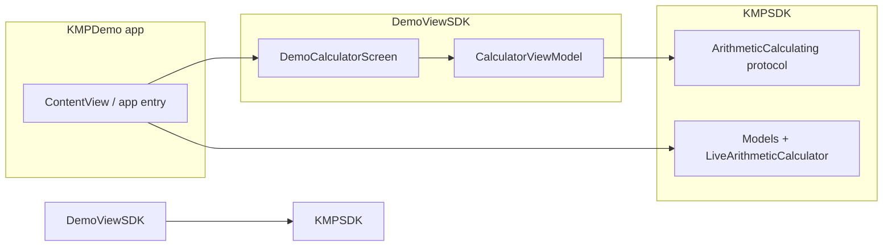

# Integration architecture: app + two SDKs

This document describes how **KMPDemo**, **DemoViewSDK**, and **KMPSDK** fit together. Use it to align with teammates on responsibilities and data flow.

## Roles

| Piece | Responsibility |
|--------|----------------|
| **KMPSDK** (“logic SDK”) | Domain models, errors, and service abstractions (e.g. `CalculationRequest`, `ArithmeticOperator`, `ArithmeticCalculating`). **Concrete service implementations** (e.g. `LiveArithmeticCalculator`) — async work + rules; **no UI**. |
| **DemoViewSDK** (“view SDK”) | SwiftUI screens and presentation state (`DemoCalculatorScreen`, internal `CalculatorViewModel`). **Does not** own business rules; it calls into `KMPSDK` types/protocols. **Maps KMPSDK errors and results into user-visible text** (alerts, messages, empty states). |
| **KMPDemo** (host app) | **Composition root**: chooses concrete `KMPSDK` services and passes them into `DemoViewSDK` entry points. Also links both packages in Xcode. |

## Dependency graph (Swift Package Manager)



- **App → DemoViewSDK**: the app shows UI from the view SDK (`DemoCalculatorScreen`).
- **App → KMPSDK**: the app instantiates **concrete** logic (e.g. `LiveArithmeticCalculator()`) and injects it into the view SDK.
- **DemoViewSDK → KMPSDK**: the view SDK depends on the logic SDK for **shared types and the service protocol** so the UI can compile against a stable contract. Production “which implementation” is still decided **only in the app** (dependency injection).

## End-to-end flow (what happens on screen)

1. **App** creates a concrete calculator that conforms to `ArithmeticCalculating` (e.g. `LiveArithmeticCalculator`).
2. **App** presents `DemoCalculatorScreen(calculator:)` from **DemoViewSDK**, passing that instance in.
3. **DemoViewSDK** holds an internal **CalculatorViewModel** bound to that calculator.
4. User edits operands / operator and taps **Calculate**.
5. **ViewModel** builds a `CalculationRequest` (**KMPSDK** model) and calls `calculator.calculate(_:)` (**KMPSDK** contract).
6. **Success or failure** returns from **KMPSDK** (typed errors, cancellation, etc.). **DemoViewSDK** does not reinterpret business rules; it **displays** outcomes (success values, error messages, loading state).

**Error propagation:** KMPSDK **throws or returns** failures from the service layer. **DemoViewSDK** is responsible for **catching** those at the presentation boundary and **showing** them in the UI (and for not leaking raw SDK errors if the product needs a friendlier copy).

So: **data and rules originate from KMPSDK**; **layout, interaction, and how errors/results are shown** are DemoViewSDK; **wiring is KMPDemo**.

## One-line summary (for standups / RFCs)

> The host app renders **DemoViewSDK** UI and injects **KMPSDK** implementations; **DemoViewSDK** depends on **KMPSDK** for models and protocols, while the app decides which concrete services run in production.

## Demo scenario in code

Arithmetic (+, −, ×, ÷) with optional simulated latency in `LiveArithmeticCalculator` stands in for “real” async logic (e.g. API). Replace that type in the app with another `ArithmeticCalculating` implementation without changing **DemoViewSDK**’s public screen API.

## Repository layout

```
DemoProjects/
├── KMPDemo/          # iOS app (composition root)
├── DemoViewSDK/      # Swift package — UI
├── KMPSDK/           # Swift package — models + logic contracts + default calculator
└── ARCHITECTURE.md   # this file
```
